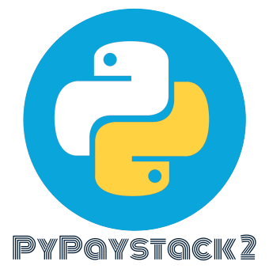

<center>A developer friendly client library for Paystack</center>
<hr/>

Documentation: [https://gray-adeyi.github.io/pypaystack2/](https://gray-adeyi.github.io/pypaystack2/)

Source Code: [https://github.com/gray-adeyi/pypaystack2](https://github.com/gray-adeyi/pypaystack2)
<hr/>

PyPaystack2 is an Open Source Python client library for integrating [Paystack](https://paystack.com/) into your python
projects. It aims at being developer friendly and easy to use.

The key features are:

* **Type hints**: All methods provided by PyPaystack2 are type annotated, so you can infer. This improves the
  development experience.
* **Async support**: PyPaystack2 allow you to also make calls to Paystack API using `async/await` which is super great,
  for example, if your project is in [FastAPI](https://fastapi.tiangolo.com/) where every chance of a performance
  improvement adds up.
* **Pydantic**: PyPaystack2 now uses pydantic for data presentation. client methods return `Response` which is
  a pydantic model, the data in the response are also presented with pydantic e.g.  `Response[Transaction]` is
  an example of a response that may be returned by client method. This can be interpreted as the response contains
  a transaction resource as the data. i.e. `Response.data` is `Transaction` which is also a pydantic model
* **Fees Calculation utilities**: PyPaystack2 provides utilities for calculating paystack's transaction fees and
  converting between base units and subunits of a currency

## Requirements

Paypaystack2 `<=3.0.0` requires a minimum Python version of `>=3.11`. For python `<3.11` See older versions of
this project

## Installation

```bash
$ pip install pypaystack2
# or with uv
$ uv add pypaystack2
```

## Examples

### Usage in a synchronous context

```bash
Python 3.11.11 (main, Feb 12 2025, 14:51:05) [Clang 19.1.6 ] on linux
Type "help", "copyright", "credits" or "license" for more information.
>>> from pypaystack2 import PaystackClient
>>> client = PaystackClient() # assumes the environmental variable `PAYSTACK_SECRET_KEY="YOUR_PAYSTACK_SECRET_KEY"` is set. if not, you can alternatively pass it into the `PaystackClient` instantiation like so PaystackClient(secret_key='YOUR_PAYSTACK_SECRET_KEY')
>>> response = client.customers.get_customer(email_or_code="CUS_8x2byd6x3dk5hp0")
>>> print(response)
Response(
  status_code=<HTTPStatus.OK: 200>,
  status=True,
  message='Customer retrieved',
  data=Customer(
    integration=630606,
    id=87934333,
    first_name='john',
    last_name='doe',
    email='johndoe@example.com',
    customer_code='CUS_8x2byd6x3dk5hp0',
    phone=None,
    metadata=None,
    risk_action=<RiskAction.DEFAULT: 'default'>,
    international_phone_format=None,
    identified=False,
    identifications=None,
    transactions=[],
    subscriptions=[
      Subscription(
        customer={'international_format_phone': None},
        plan={},
        integration=630606,
        domain=<Domain.TEST: 'test'>,
        start=None, status='active',
        quantity=None,
        amount=100000,
        subscription_code='SUB_4sje2s7kb30m5bt',
        email_token='uqzg0vneparuxtm',
        authorization=Authorization(
          authorization_code=None,
          bin=None,
          last4=None,
          exp_month=None,
          exp_year=None,
          channel=None,
          card_type=None,
          bank=None,
          country_code=None,
          brand=None,
          reusable=None,
          account_name=None
          ),
        easy_cron_id=None,
        cron_expression='54 20 5 3 *',
        next_payment_date=datetime.datetime(2026, 3, 5, 20, 54, tzinfo=TzInfo(UTC)),
        open_invoice=None,
        invoice_limit=0,
        id=759264,
        split_code=None,
        cancelled_at=None,
        updated_at=None,
        payments_count=None,
        most_recent_invoice=None,
        invoices=[],
        invoice_history=None
          )
        ],
        authorizations=[
          Authorization(
            authorization_code='AUTH_ohnpjcd7z9',
            bin='408408',
            last4='4081',
            exp_month='12',
            exp_year='2030',
            channel='card',
            card_type='visa ',
            bank='TEST BANK',
            country_code=<Country.NIGERIA: 'NG'>,
            brand='visa',
            reusable=True,
            account_name=None
          )],
        created_at=datetime.datetime(2022, 7, 25, 3, 46, 1, tzinfo=TzInfo(UTC)),
        updated_at=datetime.datetime(2022, 7, 25, 3, 46, 1, tzinfo=TzInfo(UTC)),
        total_transactions=0,
        total_transaction_value=[],
        dedicated_account=None,
        dedicated_accounts=[]
        ), ]
        meta=None,
        type=None,
        code=None,
        raw={
          'status': True,
          'message': 'Customer retrieved',
          'data': {
            'transactions': [],
            'subscriptions': [
              {
                'id': 759264,
                'domain': 'test',
                'status': 'active',
                'subscription_code': 'SUB_4sje2s7kb30m5bt',
                'email_token': 'uqzg0vneparuxtm',
                'amount': 100000,
                'cron_expression': '54 20 5 3 *',
                'next_payment_date': '2026-03-05T20:54:00.000Z',
                'open_invoice': None,
                'createdAt': '2025-03-05T20:54:33.000Z',
                'integration': 630606,
                'plan': {},
                'authorization': {
                  'exp_month': None,
                  'exp_year': None,
                  'account_name': None
                  },
                'customer': {
                  'international_format_phone': None
                  },
                'invoices': [],
                'invoices_history': [],
                'invoice_limit': 0,
                'split_code': None,
                'most_recent_invoice': None,
                'metadata': None
              }],
            'authorizations': [
            {
              'authorization_code': 'AUTH_ohnpjcd7z9',
              'bin': '408408',
              'last4': '4081',
              'exp_month': '12',
              'exp_year': '2030',
              'channel': 'card',
              'card_type': 'visa ',
              'bank': 'TEST BANK',
              'country_code': 'NG',
              'brand': 'visa',
              'reusable': True,
              'signature': 'SIG_JOdryeujwrsZryg0Lkrg',
              'account_name': None
              }],
            'first_name': 'john',
            'last_name': 'doe',
            'email': 'johndoe@example.com',
            'phone': None,
            'metadata': None,
            'domain': 'test',
            'customer_code': 'CUS_8x2byd6x3dk5hp0',
            'risk_action': 'default',
            'id': 87934333,
            'integration': 630606,
            'createdAt': '2022-07-25T03:46:01.000Z',
            'updatedAt': '2022-07-25T03:46:01.000Z',
            'created_at': '2022-07-25T03:46:01.000Z',
            'updated_at': '2022-07-25T03:46:01.000Z',
            'total_transactions': 0,
            'total_transaction_value': [],
            'dedicated_account': None,
            'dedicated_accounts': [],
            'identified': False,
            'identifications': None}})
>>>
```

All you need to interact with Paystack's API in your python project is the `PaystackClient` class it provides bindings
to different sub clients that provide methods that let you interact with paystack. The `PaystackClient` class also
provides fees calculation utility methods like `to_subunit`, `to_base_unit` and `calculate_fee`.
Every method call on the sub client bindings that makes an HTTP Request to paystack has the same generic return type
, which is a [Response](reference/index.md#pypaystack2.models.Response) a pydantic model representing the result of the
request. The content of the data attribute may vary based on the request that was made.

### Usage in an asynchronous context

`AsyncPaystackClient` is an asynchronous mirror equivalent of the `PaystackClient` client. i.e. `AsyncPaystackClient`
provides the same functionality as `PaystackClient` but is more useful in the context of non-blocking `async\await`
code. All the bindings on the `AsyncPaystackClient` are the same as ones in `PaystackClient`
except that the methods on the `AsyncPaystackClient` are `awaitable`. Run the async REPL with `python -m asyncio`

```bash
asyncio REPL 3.11.11 (main, Feb 12 2025, 14:51:05) [Clang 19.1.6 ] on linux
Use "await" directly instead of "asyncio.run()".
Type "help", "copyright", "credits" or "license" for more information.
>>> import asyncio
>>> from pypaystack2 import AsyncPaystackClient
>>> paystack = AsyncPaystackClient() # assumes the environmental variable `PAYSTACK_SECRET_KEY="YOUR_SECRET_KEY"` is set. if not, you can alternatively pass it into the `AsyncPaystackClient` instantiation like so AsyncPaystackClient(secret_key='YOUR_SECRET_KEYS')
>>> response = await paystack.customers.get_customer(email_or_code="CUS_8x2byd6x3dk5hp0")
>>> print(response)
Response(
  status_code=<HTTPStatus.OK: 200>,
  status=True,
  message='Customer retrieved',
  data=Customer(
    integration=630606,
    id=87934333,
    first_name='john',
    last_name='doe',
    email='johndoe@example.com',
    customer_code='CUS_8x2byd6x3dk5hp0',
    phone=None,
    metadata=None,
    risk_action=<RiskAction.DEFAULT: 'default'>,
    international_phone_format=None,
    identified=False,
    identifications=None,
    transactions=[],
    subscriptions=[
      Subscription(
        customer={'international_format_phone': None},
        plan={},
        integration=630606,
        domain=<Domain.TEST: 'test'>,
        start=None, status='active',
        quantity=None,
        amount=100000,
        subscription_code='SUB_4sje2s7kb30m5bt',
        email_token='uqzg0vneparuxtm',
        authorization=Authorization(
          authorization_code=None,
          bin=None,
          last4=None,
          exp_month=None,
          exp_year=None,
          channel=None,
          card_type=None,
          bank=None,
          country_code=None,
          brand=None,
          reusable=None,
          account_name=None
          ),
        easy_cron_id=None,
        cron_expression='54 20 5 3 *',
        next_payment_date=datetime.datetime(2026, 3, 5, 20, 54, tzinfo=TzInfo(UTC)),
        open_invoice=None,
        invoice_limit=0,
        id=759264,
        split_code=None,
        cancelled_at=None,
        updated_at=None,
        payments_count=None,
        most_recent_invoice=None,
        invoices=[],
        invoice_history=None
          )
        ],
        authorizations=[
          Authorization(
            authorization_code='AUTH_ohnpjcd7z9',
            bin='408408',
            last4='4081',
            exp_month='12',
            exp_year='2030',
            channel='card',
            card_type='visa ',
            bank='TEST BANK',
            country_code=<Country.NIGERIA: 'NG'>,
            brand='visa',
            reusable=True,
            account_name=None
          )],
        created_at=datetime.datetime(2022, 7, 25, 3, 46, 1, tzinfo=TzInfo(UTC)),
        updated_at=datetime.datetime(2022, 7, 25, 3, 46, 1, tzinfo=TzInfo(UTC)),
        total_transactions=0,
        total_transaction_value=[],
        dedicated_account=None,
        dedicated_accounts=[]
        ), ]
        meta=None,
        type=None,
        code=None,
        raw={
          'status': True,
          'message': 'Customer retrieved',
          'data': {
            'transactions': [],
            'subscriptions': [
              {
                'id': 759264,
                'domain': 'test',
                'status': 'active',
                'subscription_code': 'SUB_4sje2s7kb30m5bt',
                'email_token': 'uqzg0vneparuxtm',
                'amount': 100000,
                'cron_expression': '54 20 5 3 *',
                'next_payment_date': '2026-03-05T20:54:00.000Z',
                'open_invoice': None,
                'createdAt': '2025-03-05T20:54:33.000Z',
                'integration': 630606,
                'plan': {},
                'authorization': {
                  'exp_month': None,
                  'exp_year': None,
                  'account_name': None
                  },
                'customer': {
                  'international_format_phone': None
                  },
                'invoices': [],
                'invoices_history': [],
                'invoice_limit': 0,
                'split_code': None,
                'most_recent_invoice': None,
                'metadata': None
              }],
            'authorizations': [
            {
              'authorization_code': 'AUTH_ohnpjcd7z9',
              'bin': '408408',
              'last4': '4081',
              'exp_month': '12',
              'exp_year': '2030',
              'channel': 'card',
              'card_type': 'visa ',
              'bank': 'TEST BANK',
              'country_code': 'NG',
              'brand': 'visa',
              'reusable': True,
              'signature': 'SIG_JOdryeujwrsZryg0Lkrg',
              'account_name': None
              }],
            'first_name': 'john',
            'last_name': 'doe',
            'email': 'johndoe@example.com',
            'phone': None,
            'metadata': None,
            'domain': 'test',
            'customer_code': 'CUS_8x2byd6x3dk5hp0',
            'risk_action': 'default',
            'id': 87934333,
            'integration': 630606,
            'createdAt': '2022-07-25T03:46:01.000Z',
            'updatedAt': '2022-07-25T03:46:01.000Z',
            'created_at': '2022-07-25T03:46:01.000Z',
            'updated_at': '2022-07-25T03:46:01.000Z',
            'total_transactions': 0,
            'total_transaction_value': [],
            'dedicated_account': None,
            'dedicated_accounts': [],
            'identified': False,
            'identifications': None}})
>>>
```

## License

This project is licensed under the terms of the MIT license.

## Contributors

- [gray-adeyi](https://github.com/gray-adeyi)

## Related Projects

| Name                                                                               | Language              | Functionality                                                                    |
|------------------------------------------------------------------------------------|-----------------------|----------------------------------------------------------------------------------|
| [Paystack CLI](https://pypi.org/project/paystack-cli/)                             | Python                | A command line app for interacting with paystack APIs                            |
| [paystack](https://github.com/gray-adeyi/paystack)                                 | Go                    | A client library for integration paystack in go                                  |
| [@gray-adeyi/paystack-sdk](https://www.npmjs.com/package/@gray-adeyi/paystack-sdk) | Typescript/Javascript | A client library for integrating paystack in Javascript runtimes (Node,Deno,Bun) |
| [paystack](https://pub.dev/packages/paystack)                                      | Dart                  | A client library for integration paystack in Dart                                |

## Buy me a coffee

[https://www.buymeacoffee.com/jigani](https://www.buymeacoffee.com/jigani)
