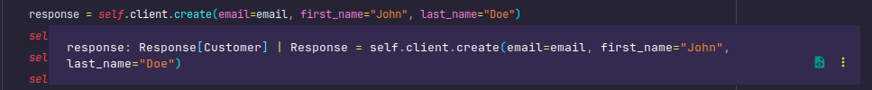
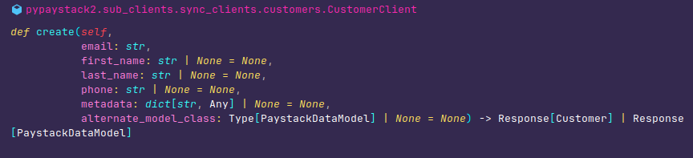

# Paystack Command line Client

This tutorial aims to expose you to how to use `pypaystack2` in your python projects for paystack integrations.
We'll be building a simple command line application that integrates with paystack's services.

## Project Setup

We'll start by setting up our project. We'll be using [uv](https://docs.astral.sh/uv/) for managing this project's
dependencies and environment. you're free to use your preferred choice like `virtualenv`, `hatch` or `poetry`.
if you don't have `uv` installed yet, you can install it with the installation script in its documentation
[here](https://docs.astral.sh/uv/getting-started/installation/) or with `pip install uv`. Preferably you use the
installation script, but if you use pip to install it, it's important to note that `uv` should be
installed globally and not within a virtual environment. You're good to proceed if this prerequisite is met.

- **Initialize our project with uv.**

```bash
uv init paystack-cli-client && cd paystack-cli-client
```

Your directory structure should look similar to this

```bash
paystack-cli-client
├── main.py
├── pyproject.toml
└── README.md

1 directory, 3 files
```

This is the default you get from initializing your project with `uv` as a bin project. The `main.py` contains a sample
code which we won't be needing, an empty `README.md` file and a `pyproject.toml` file that contains your project's
metadata such as the project's name, version, dependencies e.t.c. Some hidden files and directory are not listed here
such as a `.git` folder as `uv` initializes an empty git repository in the newly instantiated project. The use of git
is not covered in this tutorial, please commit your code as you see fit. There is also a `.python-version` file which
is used by `uv` to determine the python to use for initializing the virtual environment. A `.venv` directory will
eventually be added when a virtual environment is created by `uv` as a result of installing the projects dependency
or running `uv sync`

- **Install the projects dependencies.** We'll be needing `pypaystack2`, `python-dotenv`, and `typer`.
  `pypaystack2` is our client library for integrating with paystack. `python-dotenv` helps us manage our
  environmental variables and [typer](https://typer.tiangolo.com/) makes building command line apps in python super
  simple.

```bash
uv add pypaystack2 python-dotenv typer
```

- **Activate your virtual environment** accordingly (for mac and linux `source .venv/bin/activate`)

If all work's fine, you're good to proceed.

## Environmental Variables

`pypaystack2` depends on your paystack secret key that you get from signing up to paystack.
Paystack provides you with two pairs. A pair of public and secret keys for live mode and another set
for test mode. You can find them in your account settings. Since this is just a tutorial, we'll be
using only the test secret key. Create a new file named `.env` within your project's root directory.
Now put in your test secret key in the `.env` file like so.

```env
PAYSTACK_SECRET_KEY = "YOUR_PAYSTACK_SECRET_KEY"
```

!!! warning

    Because this is just a tutorial, no extra measure is made to protect this environmental.
    In a more serious project or production code, extra care should be taken to protect it and
    also avoid pushing it to a remote source control like GitHub.

## Let the games begin

It's time to start building! replace the boilerplate code in the `main.py` file in your root directory with
the snippet below

```python
# paystack-cli-client/main.py
from dotenv import load_dotenv

load_dotenv()
```

What we have just done is loaded our secret test key within the `.env` file. You may be
wondering why do we need that, here's why `pypaystack2` needs this key to authorize its communication with
paystack's REST API. It is the bearer token used in the requests. You can pass your secret key directly into
the clients i.e. `PaystackClient` or `AsyncPaystackClient`. Passing your secret key directly to the clients,
overrides the secret key set in the environmental variables if any.

!!! note

    You don't have to provide your secret key on the instantiation of any of the clients
    as long as you have it set in your environmental variables like this tutorial does.

## On your marks!

The first feature we'll be implementing for our **Paystack Command line Client** is the ability to create
new customers on our paystack integration. so now update your `main.py` file with the code below.

```python
# paystack-cli-client/main.py
from dotenv import load_dotenv
from typer import Typer

load_dotenv()

app = Typer()


@app.command()
def new_customer():
    print("new customer successfully created!")


if __name__ == "__main__":
    app()
```

This is a minimum setup to building cli apps with `Typer`. Now try this in your project's root directory.

```bash
python main.py --help
```

You should see.

```bash
$ python  main.py --help

 Usage: main.py [OPTIONS]

╭─ Options ───────────────────────────────────────────────────────────────────────────────────╮
│ --install-completion          Install completion for the current shell.                     │
│ --show-completion             Show completion for the current shell, to copy it or          │
│                               customize the installation.                                   │
│ --help                        Show this message and exit.                                   │
╰─────────────────────────────────────────────────────────────────────────────────────────────╯
```

You can see that we now have a command line app that's responding to our command in this case `--help`. Let's
try out the custom command we just added.

```bash
python main.py
```

You should see

```bash
new customer successfully created!
```

At the moment, no new customer is actually getting created on your paystack integration. let's bring in
`pypaystack2` to help us get the job done. For this to work, `pypaystack2` provides clients which serves
as an abstraction over the REST APIs provided by Paystack. The two main clients you'll ever need are
`PaystackClient` and `AsyncPaystackClient`. These two clients are mirror of each other but the `AsyncPaystackClient`
is useful in asynchronous contexts such as asynchronous FastAPI endpoints. These two main clients are just
binding to other specialized clients called sub clients. For example `PaystackClient.customers` is just
a binding to an instance of `CustomerClient` which is a sub client with methods for interacting with only
paystack's customers API. As a result, `CustomerClient` may be used directly by importing it from
`pypaystack2.sub_clients` but this is discouraged, just use `PaystackClient` or `AsyncPaystackClient` as
your needs require. The sub clients are named to closely match the API they abstract and methods
on these clients correspond to endpoints on the Paystack services you're interested in so in this case,
for us to create a customer on our integration, we need to use the `CustomerClient` sub client which connects
to Paystack's Customer Services API. This is available on the `PaystackClient` via the `customers` binding.
More info of [Paystack's Customer Services API](https://paystack.com/docs/api/customer/). See also
[CustomerClient](https://gray-adeyi.github.io/pypaystack2/v3.0/reference/customer/)

```python
# paystack-cli-client/main.py
from dotenv import load_dotenv
from pypaystack2 import PaystackClient
from typer import Typer

load_dotenv()

app = Typer()
client = PaystackClient()


@app.command()
def new_customer(
        email: str,
        first_name: str | None = None,
        last_name: str | None = None,
        phone: str | None = None,
):
    print("Connecting to paystack...\n")
    response = client.customers.create(
        email=email, first_name=first_name, last_name=last_name, phone=phone
    )
    print(repr(response))
    print("\nNew customer successfully created!")


if __name__ == "__main__":
    app()
```

!!! note
All API wrappers are available on `pypaystack`. as attributes e.g. `paystack.transactions` for the Transactions API

Now if you run the script again.

```bash
python main.py
```

You get error saying you have a missing argument 'EMAIL'

```bash
$ python main.py
Usage: main.py [OPTIONS] EMAIL
Try 'main.py --help' for help.
╭─ Error ─────────────────────────────────────────────────────────────────────────────────────╮
│ Missing argument 'EMAIL'.                                                                   │
╰─────────────────────────────────────────────────────────────────────────────────────────────╯
```

Now let's try out our script with the email of the customer
we want to create.

```bash
python main.py johndoe@example.com
```

Now if all goes fine. "An Internet connection is required", you should
get something similar to this

```bash
$ python main.py johndoe@example.com
Connecting to paystack...

Response(status_code=<HTTPStatus.OK: 200>, status=True, message='Customer created', data=Customer(integration=630606, id=87934333, first_name='john', last_name='doe', email='johndoe@example.com', customer_code='CUS_8x2byd6x3dk5hp0', phone=None, metadata=None, risk_action=<RiskAction.DEFAULT: 'default'>, international_phone_format=None, identified=False, identifications=None, transactions=[], subscriptions=[], authorizations=[], created_at=datetime.datetime(2022, 7, 25, 3, 46, 1, tzinfo=TzInfo(UTC)), updated_at=datetime.datetime(2022, 7, 25, 3, 46, 1, tzinfo=TzInfo(UTC)), total_transactions=None, total_transaction_value=None, dedicated_account=None, dedicated_accounts=None), meta=None, type=None, code=None, raw={'status': True, 'message': 'Customer created', 'data': {'transactions': [], 'subscriptions': [], 'authorizations': [], 'first_name': 'john', 'last_name': 'doe', 'email': 'johndoe@example.com', 'phone': None, 'metadata': None, 'domain': 'test', 'customer_code': 'CUS_8x2byd6x3dk5hp0', 'risk_action': 'default', 'id': 87934333, 'integration': 630606, 'createdAt': '2022-07-25T03:46:01.000Z', 'updatedAt': '2022-07-25T03:46:01.000Z', 'identified': False, 'identifications': None}})

New customer successfully created!
```

**Yay! You've just created a new customer on your integration** You can check out the customer's tab in
your Paystack account dashboard to confirm this.

!!! tip

    You can also create new customers with a first name and last name like so.

    ```bash
    python main.py johndoe@example.com --first-name John --last-name Doe
    ```

## What just happened?

You have just created a new customer on your integration with the CLI app you just built. But how? If you've followed
this tutorial to this point, you already know what clients are, or you can quickly skim through the previous sections
to get a refresher. The right question should be what is the `create` method on the `CustomerClient` sub client provided
as a binding on `PaystackClient` as `customers` for. You guess right if what's on your mind is that it creates a
new customer on your integration. So as it was said earlier, all sub clients provided as bindings on the
`PaystackClient`and `AsycPaystackClient` main clients have methods on them that correspond to an endpoint on paystack
and all of these methods will return a `Response` object based on the response it gets from Paystack.
This `Response` is a pydantic model that has `status`,`status_code`,`message`, `data`, e.t.c
[see more](../reference/index.md#pypaystack2.models.Response).
The signature of the return type on the methods determine the content of `Response.data`. E.g. `Response[Customer]`
implies that `Response.data` contains a single `Customer` instance, a pydantic model representing paystack's customer
resource, `Response[list[Customer]]` implies `Response.data` contains a list of instances of `Customer` and
`Response[None]` implies `Response.data` is `None`

!!! note

    `Response.data` may still be `None` even when there's a concrete signature like `Response[Customer]`
    This only happens when pypaystack2 is unable to serialize the data in the response returned by
    paystack with the pydantic model in the signature. You'll get a warning in the logs about this
    issue and how to resolve it even though the serialization fails silently, As long as it is
    guaranteed that the model can serialize the response data, the type of `Response.data` is
    guaranteed to be an instance of that model. You may need to explicitly pass an alterate model
    class to the methods to overrided the model provided by pypaystack2 when you get this warning.

    Hovering over `response` in your IDE or code editor may show the type of response as
    `Response[Customer] | Response` which can be misleading, what is the extra  `| Response`
    about.

    

    If you hover on the create method, you get a method signature similar to this

    

    The signature says `client.customers.create` returns `Response[Customer] | Response[PaystackDataModel]`
    and there is also an additional optional `alternate_model_class` parameter in the methods parameter.
    What the signature is trying to say is that `client.customers.create` will return `Response[Customer]`
    but if you provide an  `alterate_model_class`, `client.customers.create` will return `Response[PaystackDataModel]`
    `PaystactDataModel` is just a generic that serves a placeholder for any pydantic model that represents
    a data returned by paystack. i.e. if I implement a custom customer model like so

    ```python
    from pydantic import BaseModel
    from pypaystack2 import PaystackClient
    from pypaystac2.models import Customer

    class MyCustomCustomer(BaseModel):
      ... # All attributes are skipped for simplicity

    class MyImprovedCustomer(Customer):
      ... # Overrides of incorrect attributes or addition of new attributes

    client = PaystackClient()
    response = client.customers.create(email="johndoe@example.com", alterate_model_class=MyCustomCusomer)
    # or
    response = client.customers.create(email="johndoe@example.com", alterate_model_class=MyImprovedCustomer)
    ```
    It means that `response` in  the first case is of type `Response[MyCustomCustomer]` and it is
    `Responnse[MyImprovedCustomer]` in the second case and `Response.data` is guaranteed  to be
    an instance of `MyCustomCustomer` and  `MyImprovedCustomer` respectively provided that the
    two models that serialize the data retured by paystack else `Response.data` is None and
    you get a warning of the failed serialization and  how to  fix it at a log level of WARNING.
    the raw json data returned from paystack that has been serialized to native python types is
    available in `Response.raw`

```python
response = client.customers.create(email=email, first_name=first_name, last_name=last_name, phone=phone)
```

You can access the attributes of the `Response` model instance like
`response.status`, `response.status_code`, `response.message`, `response.data` and
[more](../reference/index.md#pypaystack2.models.Response)

## More Commands!

Let's add a few more commands to our **Paystack Command line Client**

```python
# root-dir/main.py
from dotenv import load_dotenv
from pypaystack2 import PaystackClient
from typer import Typer

load_dotenv()

app = Typer()
client = PaystackClient()


@app.command()
def new_customer(
        email: str,
        first_name: str | None = None,
        last_name: str | None = None,
        phone: str | None = None,
):
    response = client.customers.create(
        email=email, first_name=first_name, last_name=last_name, phone=phone
    )
    print("Connecting to paystack...\n")
    print(repr(response))
    print("\nNew customer successfully created!")


@app.command()
def list_customers(count: int = 2):
    response = client.customers.get_customers(pagination=count)
    print("Connecting to paystack...\n")
    print(repr(response))
    print("\nCustomers retrieved!")


@app.command()
def get_customer(ec: str):
    response = client.customers.get_customer(email_or_code=ec)
    print("Connecting to paystack...\n")
    print(repr(response))
    print("\nCustomer retrieved!")


@app.command()
def update_customer(code: str, last_name: str, first_name: str):
    response = client.customers.update(
        code=code, last_name=last_name, first_name=first_name
    )
    print("Connecting to paystack...\n")
    print(repr(response))
    print("\nCustomer updated!")


if __name__ == "__main__":
    app()
```

We now have 3 new commands for our cli app. you can check them out with

```bash
python main.py --help
```

Now under the available command you should see `get-customer`, `list-customers`, `new-customer`,
update-customer

```bash
$ python  main.py --help

 Usage: main.py [OPTIONS] COMMAND [ARGS]...

╭─ Options ───────────────────────────────────────────────────────────────────────────────────╮
│ --install-completion          Install completion for the current shell.                     │
│ --show-completion             Show completion for the current shell, to copy it or          │
│                               customize the installation.                                   │
│ --help                        Show this message and exit.                                   │
╰─────────────────────────────────────────────────────────────────────────────────────────────╯
╭─ Commands ──────────────────────────────────────────────────────────────────────────────────╮
│ new-customer                                                                                │
│ list-customers                                                                              │
│ get-customer                                                                                │
│ update-customer                                                                             │
╰─────────────────────────────────────────────────────────────────────────────────────────────╯
```

You can try out the new command with the following commands

```bash
$ python main.py list-customers
```

```bash
$ python main.py get-customer johndoe@example.com
```

Wow, that's amazing! We can make it better. With it be better if the cli return json data instead
of dumping python types to the console? Sure! We can leverage pydantic for that because every
model in `pypaystack2` is a pydantic model

```diff
# Replace all
-- print("Connecting to paystack...")
-- print(repr(response))
-- print("THE_SUCCESS_MESSAGE")
# with
++ print(response.model_dump_json())
```

Neat! Now we may run the CLI like so to get the result of the request written into a file.

```bash
$ python main.py get-customer johndoe@example.com > dump.json
```

!!! note

    There's one more edge case we're not handling in our current CLI implementation. Exceptions!
    all client methods that make a API call to paystack can raise `ValueError` and `ClientNetworkError`.
    `ValueError` is raised when there's an issue with the parameter combination passed or there's a
    missing parameter. This may not require any special handling as it is just an indicator of a
    misuse of the client methods and no requests are made yet. `ClientNetworkError` may  require
    handling as it's an indication of network related issues such as a poor connection or a timeout.
    for example the snippet below will raise a `ClientNetworkError` when run without an internet
    connection. `ClientNetworkError` is just a wrapper over the underlying `httpx` exception
    that  was raised.

    ```python
    from pypaystack2 import PaystackClient
    from pypaystack2.exceptions import ClientNetworkError

    try:
      response = client.customers.create(email="johndoe@example.com")
    except ClientNetworkError as error:
      print(f'ClientNetworkError was indeed raised: {error}')
    ```

## Where to go from here

**It's all in your hands now**. We now have a working CLI app, but it does not have all the features
to make it a fully fledged **Paystack command line client** you can implement
more commands. This tutorial has served its purpose giving you the confidence to use `pypaystack2` for your
desired integration with Paystack. You can check out the fully
built [paystack-cli](https://pypi.org/project/paystack-cli/) which can
be quite useful for developmental
purposes. Not sure how something works,check the doc strings, check the [API reference](../reference/index.md),
you can always search the documentation too. Good luck on your next project!
